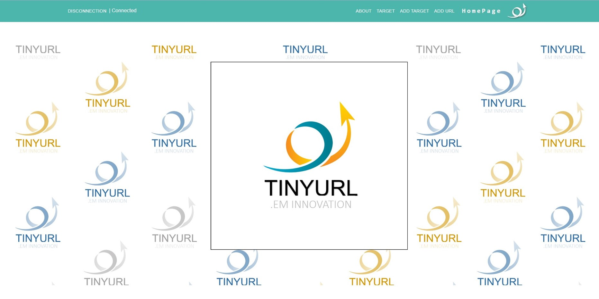
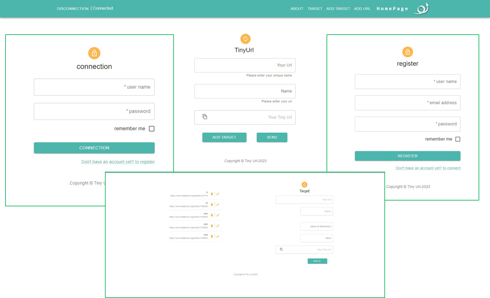

# TinyUrl Platform

>TinyUrl platform built with the MERN stack.





### Install Dependencies (frontend & backend)

```
cd frontend
npm install
```

```
cd backend
npm install
```

### Run

```

# Run frontend (:3000) & backend (:5000)
npm run dev

# Run backend only
npm run server

